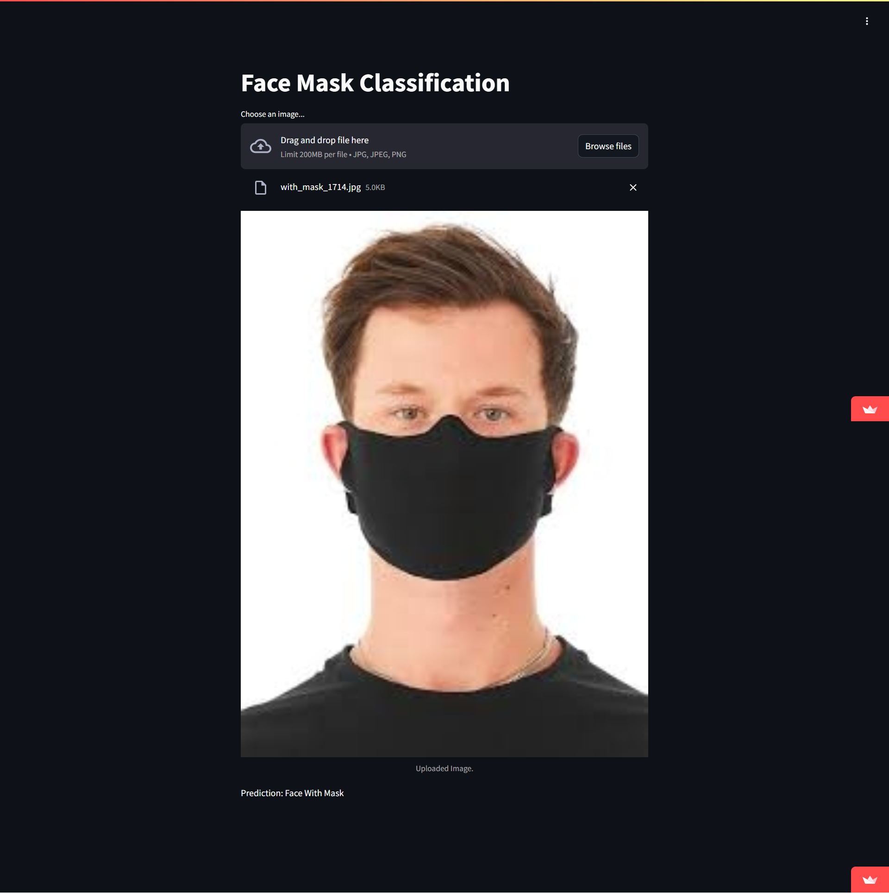

# Face-Mask-Classification
This repository contains a Streamlit application for classifying face masks based on user image uploads. The prediction is made using a pre-trained deep learning model.

## Deployment
Link deployment for public:
https://face-mask-classification-by-ika.streamlit.app/

## Contents
- `app.py`: The main Streamlit application script.
- `mask_classifier.h5`: The trained deep learning model used for classification.
- `Face_Mask_Classification-Ika_Nurfitriani.ipynb`: A Jupyter Notebook used for model training and evaluation.
- `requirements.txt`: To specify the Python packages and their versions that are required to run application.

## Usage
1. User Input: Upload image
2. Prediction: After uploading the image, the prediction result will show.

## Project Setup / Installation Instructions
1. Clone the repository from GitHub:  
   ```
   git clone https://github.com/ikanurfitriani/Face-Mask-Classification.git
   ```

2. Navigate to the project directory:  
   ```
   cd Face-Mask-Classification
   ```

3. Install the required dependencies:  
   ```
   pip install -r requirements.txt
   ```

4. Run the Streamlit application:  
   ```
   streamlit run app.py
   ```

## Screen Capture
The following is a screen capture from the Face Mack Classification App:
- `SS1`
 

- `SS2`


## Author
[@Ika Nurfitriani](https://github.com/ikanurfitriani)